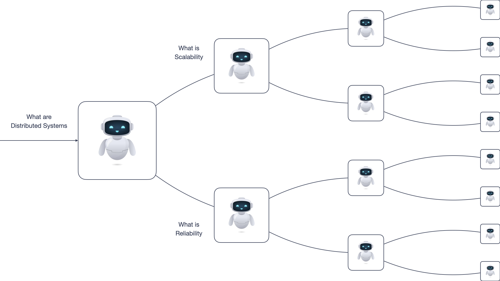

# Deep Research Agent

A Research Agent powered by Resonate and OpenAI. The Research Agent is a distributed, recursive agent that breaks a research topic into subtopics, researches each subtopic recursively, and synthesizes the results.



## How It Works

This example demonstrates how complex, distributed agentic applications can be implemented with simple code in Resonate's Distributed Async Await: The research agent is a recursive generator function that breaks down topics into subtopics and invokes itself for each subtopic:

```typescript
function* research(ctx, topic, depth) {
  const messages = [
    { role: "system", content: "Break topics into subtopics..." },
    { role: "user", content: `Research ${topic}` }
  ];

  while (true) {
    // Ask the LLM about the topic
    const response = yield* ctx.run(prompt, messages, ...);
    messages.push(response);

    // If LLM wants to research subtopics...
    if (response.tool_calls) {
      const handles = [];

      // Spawn parallel research for each subtopic
      for (const tool_call of response.tool_calls) {
        const subtopic = ...;
        const handle = yield* ctx.beginRpc(research, subtopic, depth - 1);
        handles.push([tool_call, handle]);
      }

      // Wait for all subtopic results
      for (const [tool_call, handle] of handles) {
        const result = yield* handle;
        messages.push({ role: "tool", ..., content: result });
      }
    } else {
      // LLM provided final summary
      return response.content;
    }
  }
}
```

The following video visualizes how this recursive pattern creates a dynamic call graph, spawning parallel research branches that fan out as topics are decomposed, then fan back in as results are synthesized:

https://github.com/user-attachments/assets/cf466675-def3-4226-9233-a680cd7e9ecb

**Key concepts:**
- **Concurrent Execution**: Multiple subtopics are researched concurrently via `ctx.beginRpc`
- **Coordination**: Handles are collected first, then awaited together (a.k.a fork/join, fan-out/fan-in)
- **Depth control**: Recursion stops when `depth` reaches 0

---

## Installation & Usage

### 1. Prerequisits

To run this project you need an [OpenAI API Key](https://platform.openai.com) and export the key as an environment variable

```
export OPENAI_API_KEY="sk-..."
```

### 1. Clone the repository

```
git clone https://github.com/resonatehq-examples/openai-deep-research-agent-ts
cd openai-deep-research-agent-ts
```

### 2. Install dependencies

```
npm install
```

### 3. Run the Agent locally, without durability

```
npx tsx index.ts <id> <topic> [depth]
```

Example:

```
npx tsx index.ts research-001 "What are distributed systems" 1
```

## Troubleshooting

The Deep Research Agent depends on OpenAI and the OpenAI TypeScript and JavaScript SDK. If you are having trouble, verify that your OpenAI credentials are configured correctly and the model is accessible by running the following command in the project's directory:

```
node -e "import OpenAI from 'openai'; const client = new OpenAI({ apiKey: process.env.OPENAI_API_KEY }); (async () => { const res = await client.chat.completions.create({ model: 'gpt-5', messages: [{ role: 'user', content: 'knock knock' }] }); console.log(res.choices[0].message); })();"
```

If everything is configured correctly, you will see a response from OpenAI such as:

```
{ role: 'assistant', content: "Who's there?", refusal: null, annotations: []}
```

If you are still having trouble, please open an issue on the [GitHub repository](https://github.com/resonatehq-examples/openai-deep-research-agent-ts/issues).
